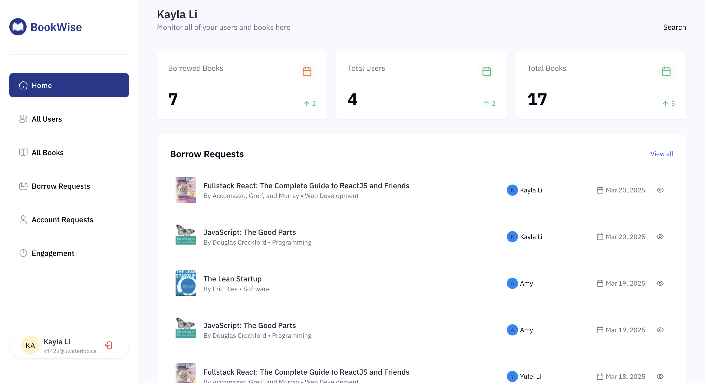

# BookWise 📚

A modern library management system built with Next.js, TypeScript, and PostgreSQL.

## Overview

BookWise is a library management platform that allows users to browse books, borrow and return items, and receive digital receipts. Administrators can manage the collection, approve borrowing requests, and oversee user access.

**Live Preview:** [books.kayla-li.com](https://books.kayla-li.com)

> **Note:** To view the admin dashboard, please go to the my-profile page to request admin access. I will approve it asap!

## Features

- 🔐 **User Authentication** - Secure login and registration system
- 📚 **Book Management** - Browse, search, and filter books
- 📝 **Borrowing System** - Borrow, return, and track books
- 📊 **Admin Dashboard** - Comprehensive library management
- 📧 **Notifications** - Email alerts for borrows, returns, and due dates
- 🧾 **Digital Receipts** - PDF receipts for all transactions
- 🔔 **Engagement System** - User activity tracking and reminders

## Tech Stack

- **Frontend**: Next.js 15, React, TypeScript, Tailwind CSS
- **Backend**: Next.js Server Actions & API Routes
- **Database**: PostgreSQL (Neon), Drizzle ORM
- **Authentication**: NextAuth.js
- **Storage**: ImageKit
- **Email**: Resend

[//]: # (- **Caching & Jobs**: Upstash Redis, QStash)
